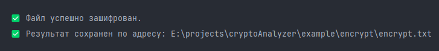

<h1 style="text-align: center">Caesar Cipher Encryptor (Шифратор Цезаря)</h1>


<p align="center">
  
</p>

## Описание

Программа для шифрования и расшифровки текстовых файлов с использованием **шифра Цезаря**. Поддерживает как работу по ключу, так и автоматический подбор ключа методом перебора.

## Features / Функции

- 📂 Чтение текстовых файлов с диска
- 🔐 Шифрование текста по заданному ключу
- 🔓 Расшифровка по ключу
- 🕵️ Расшифровка **без ключа** методом полного перебора (брутфорс)
- 📄 Запись результатов в новый файл
- 🇷🇺 Поддержка **русского алфавита, цифр и знаков препинания**
- 📦 Работа с **любым объёмом текста**
- ☕ Реализовано на **Java 24.0.1**

## Поддерживаемые операционные системы
Программа успешно работает на следующих платформах:
- Windows (версии 11)
- macOS (версии 15)

## 📦 Установка

1. Убедитесь, что у вас установлена Java 24.0.1
2. Скомпилируйте (если используете исходники):
3. Запустите 
   ```bash
   java CryptoAnalyzer
   ```  
## 📦 Скачать сборку
1. Скачать сборку можно по ссылке: [Сборка](https://github.com/khloptsevps/cryptoAnalyzer/releases/tag/v1.0.0)
2. Распаковать
3. Запустить

## 📁 Работа с файлами
Программа ожидает, что все необходимые файлы будут находиться в подкаталоге files, расположенном **рядом с cryptoAnalyzer.jar.**  
- #### Windows:  
  - Если **cryptoAnalyzer.jar** расположен в: C:\app\cryptoAnalyzer\, то файлы должны находиться в: C:\app\cryptoAnalyzer\files
  - Чтобы путь ко входящему файлу корректно работал нужно чтобы по пути C:\app\cryptoAnalyzer\files существовал файл example.txt
  - если указать имя файла, например: **input.txt**, то поиск файла будет в каталоге **files**
  - путь к файлу можно указать в формате: **C:\full\path\to\file.txt**

- #### MacOS/Linux:
   - Если **cryptoAnalyzer.jar** расположен в: /Users/user/Desktop/app/cryptoAnalyzer/, то файлы должны находиться в: /Users/user/Desktop/app/cryptoAnalyzer/files
   - Чтобы путь ко входящему файлу корректно работал нужно чтобы по пути /Users/user/Desktop/app/cryptoAnalyzer/files существовал файл example.txt
   - если указать имя файла, например: **input.txt**, то поиск файла будет в каталоге **files**
   - путь к файлу можно указать в формате: **/full/path/to/file.txt**

## 📁 Пример использования
Выберете действие:
<p>
  
</p>  

Введите путь ко входящему файлу или оставьте путь по умолчанию нажав Enter:
<p>
  
</p>  

Введите путь к исходящему файлу/директории или оставьте путь по умолчанию нажав Enter:
<p>
  
</p>  

Укажите путь сдвига по ключу:
<p>
  
</p>  

Проверьте результат:
<p>
  
</p> 

